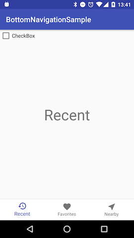

# ButtonNavigationSample

## CustomBottomNavigationView

* Currently (v25.0.1) BottomNavigationView does not save last position when configuration change (like screen rotation). CustomBottomNavigationView extends BottomNavigationView and support this feature.

## Handling fragments

* In this sample, MainActivity handle fragment transaction like FragmentPagerAdapter.

